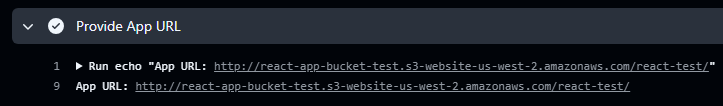

### `Shared React CI/CD pipeline`
This repository contains a reusable Github Actions workflow that automates the build and deployment of React apps to S3 bucket to the directory that matches repository name. 

To set up your repository to use this shared CI/CD pipeline, follow these steps:

### `Create or update the` **deploy.yml** `in your repo`
In your repository, create a workflow file **deploy.yml** at **.github/workflows/**. This file will trigger the shared pipeline to build and deploy your React app. Here is an example:

```yaml
name: Deploy React App

on:
  push:
    branches:
      - main

jobs:
  deploy:
    uses: apekksu/shared-react-ci-cd/.github/workflows/ci.yml@main
    with:
      s3-bucket-name: react-app-bucket-test # change to different bucket if needed
      app-directory: ${{ github.event.repository.name }} # repo name used as subdir in bucket root
    secrets:
      aws-access-key-id: ${{ secrets.AWS_ACCESS_KEY_ID }}
      aws-secret-access-key: ${{ secrets.AWS_SECRET_ACCESS_KEY }}
```

### `Using organizaion level secrets`
**AWS_ACCESS_KEY_ID**: The AWS access key ID.
**AWS_SECRET_ACCESS_KEY**: The AWS secret access key.

Secrets above are required for the pipeline to authenticate with AWS and are set on organization level secrets. Ask Tigran/Aram to check if there are issues with credentials.

### `S3 bucket creation and setup`
Buckets should be created only using **Infra** pipeline and never manually to avoid discrepancies between remote **tfstate** and actual infrastructure.
Update the value of **S3_BUCKET_NAME** in your **deploy.yml** file to point to the correct S3 bucket for your application.

The app will automatically be deployed to a subdirectory named after the Github repository. 

### `Get the public URL to deployed app`
After each deployment, the pipeline will automatically print the public URL in job **Provide App URL**



### `FAQ`
**Q**: What if I want to add the homepage field manually?

**A**: The pipeline checks whether the homepage field already exists in **package.json**. If it's there, the pipeline won’t modify it. If it's missing, the pipeline will inject the correct homepage based on the S3 bucket and directory.
